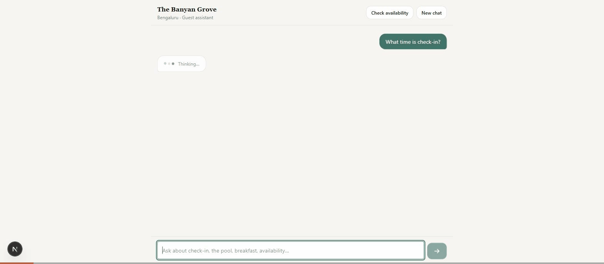
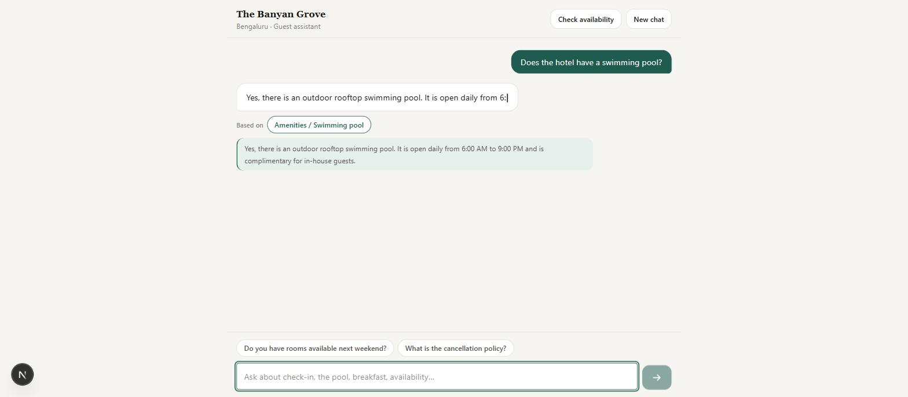
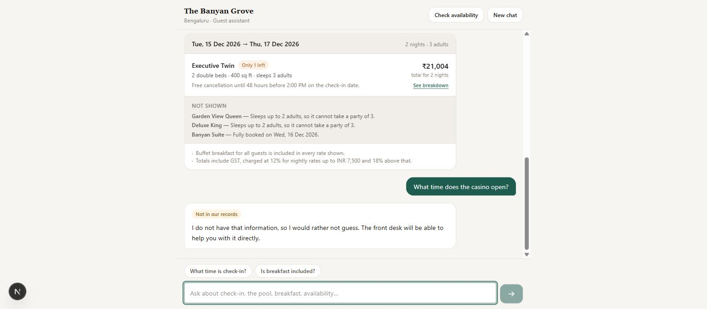

# The Banyan Grove — AI Guest Assistant

A full-stack guest assistant for a hotel website. Guests ask about the property, policies and
amenities in plain language, and check live room availability — in one conversation, without
leaving the page.

> **The Banyan Grove** is a fictional 48-room boutique hotel in Bengaluru, invented for this
> project. All rooms, rates and policies are sample data.



<table>
<tr>
<td width="50%"></td>
<td width="50%"></td>
</tr>
<tr>
<td><em>Every factual answer carries the fact that justifies it. Tap to read it.</em></td>
<td><em>Engine-computed prices, rooms that were ruled out with reasons, and an honest refusal.</em></td>
</tr>
</table>

---

## Contents

| Document | What it covers |
|---|---|
| **README.md** (this file) | Setup, how to run, project layout, scripts |
| [ARCHITECTURE.md](./ARCHITECTURE.md) | Components, request lifecycle, data flow, trade-offs |
| [PRODUCT_NOTES.md](./PRODUCT_NOTES.md) | Product, UX, AI and engineering decisions — the written answers |
| [EVALUATION.md](./EVALUATION.md) | 16 evaluation scenarios and observed results |
| [docs/api-examples.md](./docs/api-examples.md) | curl for every endpoint, including failures |
| [AI_TOOLS.md](./AI_TOOLS.md) | AI tools used while building this |

---

## What it does

- **Answers property questions** — check-in time, pool, breakfast, cancellation policy, parking,
  accessibility — grounded in a hotel knowledge base, with the supporting fact shown to the guest.
- **Checks room availability** — real date maths, occupancy rules, seasonal and weekend pricing,
  GST slabs, and per-night rate breakdowns.
- **Refuses honestly.** Ask about the casino and it says it does not have that, rather than
  inventing opening hours. This is enforced in code, not requested in a prompt.
- **Survives its dependencies.** If the model is unreachable the assistant still answers from the
  knowledge base and tells the guest it is degraded.
- **Runs with no API key.** A deterministic offline provider backs the whole app, so the entire
  test suite is green on a fresh clone.

---

## Quick start

Requires **Node 20.11+** (developed on Node 22/25) and npm 10+.

```bash
git clone <your-repo-url> hotel-guest-assistant
cd hotel-guest-assistant
npm install
npm run dev
```

Open **http://localhost:3000**. The API runs on **http://localhost:4000**.

That is the whole setup. No API key, no database, no Docker.

### Try this

1. Click **"What time is check-in?"** — note the source chip under the answer; tap it to see the
   exact knowledge-base entry behind it.
2. Type **"and checkout?"** — a follow-up that is meaningless without conversation memory.
3. Click **Check availability**, pick two dates, set adults to **3**, submit — real prices, and the
   rooms that were ruled out with the reason why.
4. Ask **"What time does the casino open?"** — an honest refusal, badged *Not in our records*.

### Turning on the real model

The app defaults to a deterministic offline provider. To use OpenAI:

```bash
cd apps/server
cp .env.example .env          # if you have not already
# then add your key to apps/server/.env:
#   AI_PROVIDER=openai
#   OPENAI_API_KEY=sk-...
```

Restart with `npm run dev`. `.env` is gitignored; the key stays in the server process and is never
sent to the browser.

### Seeing the failure path

```bash
AI_PROVIDER=failing npm run dev
```

Every answer now comes from the degraded knowledge-base path, with a banner in the UI. The API
still returns `200`, never a `500`.

---

## Project layout

```
.
├── apps/
│   ├── server/                    Express + TypeScript API (port 4000)
│   │   ├── src/
│   │   │   ├── ai/                Provider interface, OpenAI, offline mock, resilience, prompt
│   │   │   ├── domain/
│   │   │   │   ├── knowledge/     hotel-kb.json, BM25 retriever, tokenizer
│   │   │   │   ├── availability/  inventory.json, pricing, checkAvailability engine
│   │   │   │   └── conversation/  Session store, slot filling
│   │   │   ├── orchestrator/      The turn pipeline + citation validation
│   │   │   ├── routes/            chat, availability, hotel, health
│   │   │   └── middleware/        requestId, validation, rate limit, error handler
│   │   └── tests/                 unit · integration · e2e · eval scenarios
│   └── web/                       Next.js 15 + React 19 + Tailwind 4 (port 3000)
│       └── src/
│           ├── components/        ChatShell, MessageBubble, AvailabilityCard, BookingForm…
│           ├── hooks/             useChat state machine, useStickToBottom
│           └── lib/               Typed API client with its own error taxonomy
└── packages/
    └── contracts/                 Zod schemas + types shared by both sides
```

---

## Scripts

Run from the repository root.

| Command | What it does |
|---|---|
| `npm run dev` | Both apps, with hot reload |
| `npm run build` | Production build of both |
| `npm test` | Full suite — 169 tests, offline, no key needed |
| `npm run test:e2e` | 7 end-to-end tests against a real HTTP server |
| `npm run eval` | The 16 evaluation scenarios, with a pass/fail table |
| `npm run eval -- --live` | The same scenarios against the real model |
| `npm run eval -- --mode=full` | Scored with the whole knowledge base in context (A/B baseline) |
| `npm run typecheck` | TypeScript across the workspace |

---

## Configuration

**`apps/server/.env`** — see [`apps/server/.env.example`](./apps/server/.env.example).

| Variable | Default | Notes |
|---|---|---|
| `AI_PROVIDER` | `mock` | `mock` (offline) · `openai` · `failing` (fault injection) |
| `OPENAI_API_KEY` | — | Required only when `AI_PROVIDER=openai`. Validated at boot. |
| `OPENAI_MODEL` | `gpt-4o-mini` | Any chat-completions model with tool calling |
| `RETRIEVAL_MODE` | `lexical` | `lexical` (top-K) or `full` (entire KB) |
| `PORT` | `4000` | |
| `WEB_ORIGIN` | `http://localhost:3000,http://127.0.0.1:3000` | Comma-separated CORS allowlist |
| `AI_TIMEOUT_MS` | `15000` | Per model attempt |
| `AI_MAX_RETRIES` | `2` | Transient failures only |
| `RATE_LIMIT_MAX` | `30` | Requests per minute per IP, on `/api/chat` only |

**`apps/web/.env.local`** — `NEXT_PUBLIC_API_BASE_URL` (default `http://localhost:4000`). This is
the only backend configuration the browser sees.

---

## API at a glance

Full request and response examples, including every error case, are in
[docs/api-examples.md](./docs/api-examples.md).

| Method | Path | Purpose |
|---|---|---|
| `POST` | `/api/chat` | Ask a question. Accepts conversation + structured stay context. |
| `POST` | `/api/availability` | Check rooms deterministically — **no model involved**. |
| `GET` | `/api/hotel` | Bootstrap data for the UI (name, rooms, suggested questions). |
| `GET` | `/api/health` · `/api/health/ready` | Liveness and readiness. |

```bash
curl -s -X POST http://localhost:4000/api/chat \
  -H 'Content-Type: application/json' \
  -d '{"message":"What time is check-in?"}'
```

```jsonc
{
  "ok": true,
  "requestId": "…",
  "sessionId": "…",
  "reply": { "text": "Check-in starts at 2:00 PM.", "type": "answer", "confidence": 0.91 },
  "sources": [{ "id": "F26", "label": "Policies / Check-in time", "text": "Check-in starts at 2:00 PM." }],
  "availability": null,
  "slots": { "checkIn": null, "checkOut": null, "adults": null, "children": null },
  "needs": [],
  "suggestions": ["Is breakfast included?"],
  "meta": { "provider": "mock", "latencyMs": 3, "toolCalls": [], "grounded": true, "degraded": false }
}
```

---

## Testing

```bash
npm test          # 169 tests: 138 server, 31 web
npm run test:e2e  # 7 real-HTTP end-to-end tests
npm run eval      # 16 evaluation scenarios (offline)
```

Verified against the real model too: `npm run eval -- --live` scores **16/16** on `gpt-4o-mini`.
That run is worth reading about in [EVALUATION.md](./EVALUATION.md) — it initially scored 12/16 and
exposed two genuine product bugs that the offline suite could not have found.

Everything runs offline against the deterministic provider, so results are reproducible and CI
never calls a paid API. Coverage includes the retriever and its no-context gate, pricing and date
maths, citation validation, retry and circuit-breaker behaviour, the conversation state machine,
and each failure mode end to end. See [EVALUATION.md](./EVALUATION.md) for scenario-level results.

---

## Troubleshooting

**Port already in use** — the API is on 4000 and the web app on 3000. Change with `PORT` in
`apps/server/.env` and `NEXT_PUBLIC_API_BASE_URL` in `apps/web/.env.local`.

**"Invalid server configuration: OPENAI_API_KEY is required"** — `AI_PROVIDER=openai` with no key.
Add the key, or set `AI_PROVIDER=mock`.

**The UI says it cannot reach the hotel** — the API is not running, or `WEB_ORIGIN` does not
include the address you are loading the page from. Check `curl http://localhost:4000/api/health`.

**Answers feel robotic** — you are on the offline provider. That is the default. Set
`AI_PROVIDER=openai` with a key for real language.
